# Radia — Especificação do Projeto

> **Status:** Planejamento  
> **Responsáveis:** Felipe Adeildo
> **Organização:** RanqIA Labs (`ranqialabs`)

---

## Índice

1. [Visão Geral](#1-visão-geral)
2. [Objetivos](#2-objetivos)
3. [Arquitetura de Alto Nível](#3-arquitetura-de-alto-nível)
4. [Stack Tecnológica](#4-stack-tecnológica)
5. [Fontes de Dados (Sources)](#5-fontes-de-dados-sources)
6. [Pipeline de Ingestão](#6-pipeline-de-ingestão)
7. [Parsing de Documentos](#7-parsing-de-documentos)
8. [Agentes de IA](#8-agentes-de-ia)
9. [Modelo de Dados](#9-modelo-de-dados)
10. [Knowledge Graph (Graphiti)](#10-knowledge-graph-graphiti)
11. [Identificação e Matching de Entidades Nomeadas](#11-identificação-e-matching-de-entidades-nomeadas)
12. [Pipeline de Sugestão de Issues](#12-pipeline-de-sugestão-de-issues)
13. [Integração com Google Drive & Google Docs](#13-integração-com-google-drive--google-docs)
14. [Integração com GitHub](#14-integração-com-github)
15. [API Pública (Brain API)](#15-api-pública-brain-api)
16. [Interface de Revisão Humana](#16-interface-de-revisão-humana)
17. [LLM Providers & Embeddings](#17-llm-providers--embeddings)
18. [Observabilidade](#18-observabilidade)
19. [Extensibilidade: Novas Sources](#19-extensibilidade-novas-sources)
20. [Docker Compose & Infraestrutura Local](#20-docker-compose--infraestrutura-local)
21. [Estrutura do Repositório](#21-estrutura-do-repositório)
22. [Decisões em Aberto](#22-decisões-em-aberto)

---

## 1. Visão Geral

A `radia` é um sistema autônomo de **memória organizacional e sugestão de tarefas** para a RanqIA. Ele observa continuamente as fontes de conhecimento da empresa (reuniões, mensagens, documentos) e realiza duas funções principais:

1. **Construir e manter uma base de conhecimento queryável** que representa o estado atual e histórico da empresa -- decisões tomadas, mudanças de direção, contexto técnico dos projetos, pessoas e responsabilidades.

2. **Sugerir issues nos projetos do GitHub** (`ranqialabs`) com base nas decisões e action items identificados nas reuniões, cruzando com o estado atual dos repositórios para evitar duplicatas e enriquecer o contexto.

O sistema foi projetado para ser **extensível**: novas fontes de informação (WhatsApp, Slack, emails) podem ser adicionadas como novos `SourceAdapter`s sem modificar o pipeline central.

---

## 2. Objetivos

### 2.1 Knowledge Base Organizacional

- Manter um grafo de conhecimento temporal que registra **o que a empresa decidiu, quando, e por quem**
- Permitir queries do tipo:
  - *"Qual o estado atual da arquitetura do Ada?"*
  - *"O que mudou nas decisões de produto entre janeiro e março?"*
  - *"Quais decisões o Felipe tomou nas últimas duas semanas?"*
- Detectar automaticamente quando uma decisão contradiz ou atualiza uma decisão anterior
- Separar contexto de negócio (business) de contexto técnico (dev), mesmo quando surgem na mesma reunião

### 2.2 Sugestão de Issues

- A partir do conteúdo de reuniões, identificar **action items** com contexto suficiente para virar issues no GitHub
- Cruzar com issues existentes nos projetos (`ada`, `grace`, `dorothy`, etc.) para evitar duplicatas
- Sugerir o projeto correto para cada issue com base no contexto
- Identificar entidades nomeadas (pessoas) e sugerir assignees a partir dos usernames do GitHub
- Todo issue sugerido passa por **revisão humana** antes de ser criado
- Após aprovação, criar a issue no repositório correto e adicioná-la ao GitHub Projects board

### 2.3 Princípios do Sistema

- **Nunca criar issues automaticamente** sem revisão humana
- **Rastreabilidade total**: toda issue sugerida aponta para o trecho da reunião que a originou
- **Idempotência**: processar a mesma reunião duas vezes não deve duplicar dados
- **Graceful degradation**: falhas em um agente não devem travar o pipeline inteiro
- **Extensibilidade first**: abstrações que permitam adicionar novas fontes com zero refatoração do core

---

## 3. Arquitetura de Alto Nível

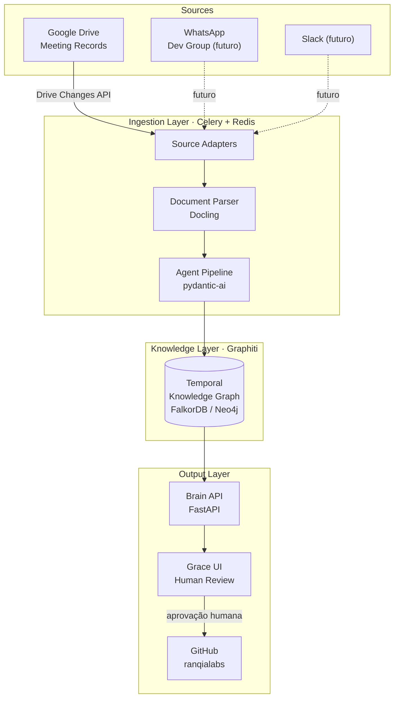

### Fluxo Geral de Dados

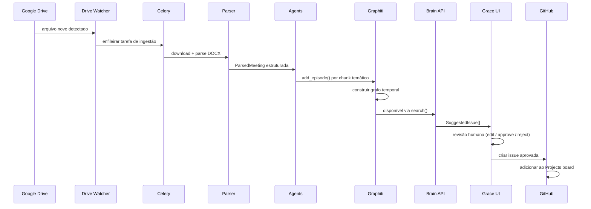

---

## 4. Stack Tecnológica

### Core

| Componente | Tecnologia | Papel |
|---|---|---|
| Knowledge Graph | `graphiti-core` | Grafo temporal, episódios, hybrid search |
| Graph DB | FalkorDB (dev) / Neo4j AuraDB (prod) | Backend do Graphiti |
| Agent Framework | `pydantic-ai` | Todos os agentes do pipeline |
| Document Parser | `docling` | Parse de DOCX, extração de tabs |
| Task Queue | `celery[redis]` | Workers de ingestão e processamento |
| Message Broker | Redis | Broker + backend do Celery |
| API Server | `fastapi` + `uvicorn` | Exposição da Brain API |
| Config | `pydantic-settings` | Variáveis de ambiente tipadas |

### Integrações

| Componente | Tecnologia | Papel |
|---|---|---|
| Google Drive | `google-api-python-client` | Watch, list, download arquivos |
| Google Auth | `google-auth-oauthlib` | Service Account para access server-side |
| GitHub | `PyGithub` | Ler issues, criar issues, ler repos |

### Providers (configurável)

| Componente | Padrão | Alternativas |
|---|---|---|
| LLM Inference | OpenAI `gpt-4o` | Anthropic Claude, modelos locais via Ollama |
| Embeddings | OpenAI `text-embedding-3-small` | Gemini embedding, modelos locais via Ollama |
| Graph DB | FalkorDB (Docker) | Neo4j, Kuzu |

### Futuras Sources

| Source | Biblioteca | Status |
|---|---|---|
| WhatsApp | `whatsapp-mcp` (interno) | Planejado |
| Slack | `slack-sdk` | Planejado |
| Email / Gmail | `google-api-python-client` (Gmail API) | Planejado |

---

## 5. Fontes de Dados (Sources)

### Abstração: `SourceAdapter`

Toda fonte de dados implementa o protocolo `SourceAdapter`. O pipeline central só conhece `RawEpisode` -- ele não sabe de onde os dados vieram.

```python
from typing import Protocol, AsyncIterator
from dataclasses import dataclass, field
from datetime import datetime
from enum import Enum

class SourceType(str, Enum):
    GOOGLE_DRIVE = "google_drive"
    WHATSAPP     = "whatsapp"
    SLACK        = "slack"
    EMAIL        = "email"

@dataclass
class RawEpisode:
    source_id:    str          # ID único na fonte (file_id, message_id, etc.)
    source_type:  SourceType
    source_name:  str          # nome legível ("Reunião Ada 15/03")
    content:      str          # texto bruto já extraído e limpo
    participants: list[str]    # nomes como aparecem na fonte
    occurred_at:  datetime     # quando aconteceu (não quando foi processado)
    metadata:     dict = field(default_factory=dict)  # campos extra da fonte

class SourceAdapter(Protocol):
    """
    Protocolo que toda fonte de dados deve implementar.
    O Celery worker chama watch() em loop e fetch() para reprocessar.
    """
    async def watch(self) -> AsyncIterator[RawEpisode]:
        """Observa continuamente. Emite RawEpisode para cada item novo."""
        ...

    async def fetch(self, source_id: str) -> RawEpisode:
        """Busca um item específico pelo ID (para reprocessamento)."""
        ...

    async def list_pending(self) -> list[str]:
        """Lista source_ids que ainda não foram processados (para bulk run inicial)."""
        ...
```

### 5.1 GoogleDriveAdapter

Observa a pasta `Meeting Records` da conta Google Workspace da RanqIA.

**Mecanismo de detecção de mudanças:**

Duas estratégias, configuráveis:

1. **Polling** (padrão dev): Celery Beat executa a cada N minutos, chama `drive.files().list()` filtrando por `modifiedTime > last_check` dentro da pasta alvo.
2. **Push notifications** (prod): registra um webhook via `drive.changes().watch()`. Google faz POST para o endpoint ao detectar mudança. O endpoint enfileira a tarefa no Celery.

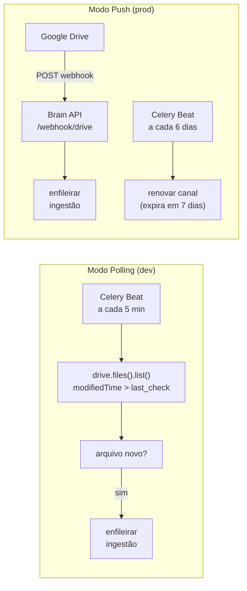

**Estado persistido no banco:**

```python
# Tabela drive_sync no banco relacional (SQLite dev / Postgres prod)
class DriveSyncState(BaseModel):
    folder_id:       str
    last_page_token: str       # usado pelo changes.list()
    channel_id:      str | None  # ID do canal de push notification
    channel_resource_id: str | None
    channel_expires_at:  datetime | None
    last_polled_at:  datetime
```

**Idempotência:** antes de enfileirar, verificar se `source_id` já existe na tabela `ingested_episodes`. Se sim, verificar `modifiedTime` -- só reprocessar se o arquivo foi modificado.

---

## 6. Pipeline de Ingestão

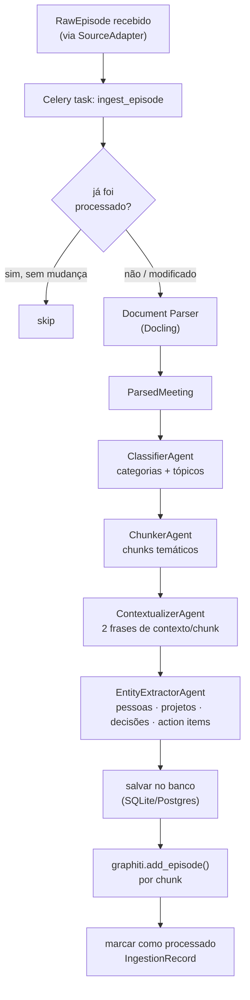

### Idempotência e Reprocessamento

Cada `RawEpisode` recebe um `episode_hash = sha256(source_id + modified_at)`. A tabela `ingestion_records` armazena esse hash. Se o hash já existe, o processamento é skippado. Para forçar reprocessamento, basta deletar o registro.

No **bulk run inicial** (primeira vez que o sistema roda), o `GoogleDriveAdapter.list_pending()` lista todos os arquivos da pasta que não estão no banco de `ingestion_records`, e enfileira todas as tarefas de ingestão em paralelo.

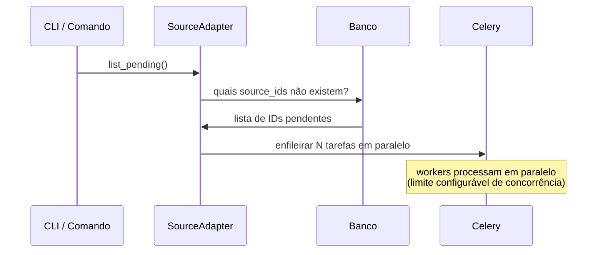

---

## 7. Parsing de Documentos

### 7.1 Formato das Transcrições (Google Gemini DOCX)

Os arquivos de transcrição são gerados pelo Gemini Notes do Google Meet. O DOCX possui **duas tabs**:

- **Tab "Notas"** (`tab_id: 0` ou título "Notas"): resumo estruturado gerado pelo Gemini com tópicos e bullet points
- **Tab "Transcrição"** (`tab_id: 1` ou título "Transcrição"): transcrição raw com o seguinte formato:

```
00:00:00
  Alexandre Farias: Opa! E aí?
  Felipe Adeildo: Salve, minha potência...

00:01:16
  Felipe Adeildo: Tipo esse forgot password...
  Alexandre Farias: Uhum. Faz...
```

O **nome do arquivo** carrega metadados implícitos:
- `"Adeildo <> Ale - Transcrição"` → reunião 1:1 entre Felipe Adeildo e Alexandre
- `"RanqIA - Weekly Dev - Transcrição"` → reunião de equipe
- `"Mateus <> Adelmo - Business Review"` → reunião de negócios

### 7.2 Estratégia de Parse

```python
@dataclass
class TranscriptSegment:
    timestamp:  str        # "00:01:16"
    speaker:    str        # "Felipe Adeildo"
    text:       str        # conteúdo da fala

@dataclass
class ParsedMeeting:
    source_id:          str
    file_name:          str
    participants:       list[str]           # extraído do nome do arquivo + transcrição
    duration_seconds:   int                 # calculado do último timestamp
    gemini_notes:       str                 # conteúdo bruto da tab de notas
    transcript_segments: list[TranscriptSegment]
    parsed_at:          datetime
```

**Processo:**

1. **Docling** abre o DOCX e extrai o conteúdo das tabs separadamente
2. **Parser determinístico** (regex, sem LLM) processa a tab de transcrição:
   - Detecta timestamps pelo padrão `HH:MM:SS` no início de uma linha
   - Detecta speaker pelo padrão `Nome Sobrenome: texto`
   - Agrupa segmentos por bloco de timestamp
3. **Inferência de participantes**: extrai do nome do arquivo + union com speakers únicos da transcrição
4. **Duração**: timestamp do último segmento convertido para segundos

**Por que sem LLM no parse?** O formato é suficientemente estruturado para parsing determinístico. Usar LLM aqui seria mais lento, mais caro e menos confiável. LLM entra apenas nos agentes posteriores.

### 7.3 Extensibilidade de Formatos

Novos formatos (Zoom VTT, Otter.ai JSON, Fireflies MD) são adicionados como estratégias no `DocumentParser`:

```python
class DocumentParser(Protocol):
    def can_parse(self, raw_episode: RawEpisode) -> bool: ...
    def parse(self, raw_episode: RawEpisode) -> ParsedMeeting: ...

# Registro de parsers (ordem = prioridade)
PARSERS = [
    GeminiDocxParser(),    # DOCX do Google Meet + Gemini Notes
    ZoomVttParser(),       # futuro
    OtterJsonParser(),     # futuro
    GenericTextParser(),   # fallback: texto puro, sem estrutura de speaker
]
```

---

## 8. Agentes de IA

Todos os agentes são implementados com `pydantic-ai`. Cada agente tem:
- `result_type`: modelo Pydantic que define o output estruturado
- `deps_type`: dependências injetadas (banco, APIs externas)
- `system_prompt`: prompt cuidadosamente elaborado para a função específica
- Retry automático via validação do Pydantic quando o LLM retorna output inválido

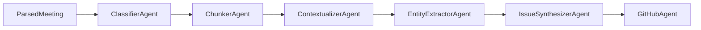

### 8.1 ClassifierAgent

**Propósito:** Categorizar a reunião e identificar os grandes tópicos discutidos.

**Input:** `ParsedMeeting` (notas + primeiros segmentos da transcrição)

**Output:**
```python
class MeetingClassification(BaseModel):
    categories:   list[Literal["dev", "business", "1:1", "planning", "retrospective", "mixed"]]
    main_topics:  list[str]   # ex: ["arquitetura multi-tenant Ada", "pricing", "sprint review"]
    meeting_type: str         # descrição livre em 1 frase
    meeting_date: date | None # tenta inferir do conteúdo se não vier nos metadados
    confidence:   float       # 0-1
```

**Estratégia:** Usa as notas do Gemini como input principal (já são um resumo estruturado). Os primeiros e últimos 10 segmentos da transcrição são adicionados como contexto adicional. Isso minimiza tokens sem perder contexto.

### 8.2 ChunkerAgent

**Propósito:** Dividir a transcrição em chunks **temáticos**, não cronológicos.

**O problema:** Uma reunião de 2h pode voltar ao mesmo assunto em momentos diferentes. Chunks por tempo fixo (blocos de 10 min) quebram o contexto temático. O chunker agrupa segmentos que falam do mesmo assunto, mesmo com gaps de tempo.

**Input:** `ParsedMeeting` + `MeetingClassification.main_topics`

**Output:**
```python
class ThematicChunk(BaseModel):
    topic:           str
    timestamp_start: str        # "00:01:16"
    timestamp_end:   str        # "00:08:43"
    speakers:        list[str]
    raw_text:        str        # concatenação dos segmentos
    chunk_type:      Literal["decision", "discussion", "action_item", "banter", "technical_detail"]
    related_projects: list[str] # ["ada", "grace"] -- quais projetos foram mencionados
```

**Estratégia:** O LLM recebe a lista de segmentos com seus timestamps e os `main_topics` já identificados. É instruído a:
1. Mapear cada segmento para um dos tópicos (ou "banter" se for conversa sem conteúdo)
2. Agrupar segmentos consecutivos do mesmo tópico em um chunk
3. Se o mesmo tópico aparecer em momentos distintos (gap > 5 min), criar chunks separados com o mesmo `topic`

### 8.3 ContextualizerAgent

**Propósito:** Adicionar contexto de 2 frases a cada chunk antes do embedding.

**Fundamentação:** Técnica de **Contextual Retrieval** da Anthropic (reduz retrieval failures em ~49%). Sem contexto, um chunk como *"eu não fiz assim, tipo, o eu não coloquei o mesmo ID aqui"* é impossível de recuperar corretamente via similarity search. Com contexto, torna-se recuperável.

**Input:** `ThematicChunk` + metadados da reunião

**Output:** `str` -- 2 frases descrevendo o chunk no contexto da empresa

**Exemplo de output:**
```
Este trecho é de uma reunião 1:1 entre Felipe Adeildo e Alexandre Farias sobre 
a arquitetura do Ada (RanqIA), em 15 de março de 2026. Discute a decisão de usar 
IDs independentes entre Grace e Ada para brands, evitando sincronização manual.
```

O que é persistido no Graphiti é `contexto + raw_text` concatenados, não só o `raw_text`.

### 8.4 EntityExtractorAgent

**Propósito:** Extrair entidades estruturadas de todos os chunks de uma reunião.

**Input:** lista de `ThematicChunk` (toda a reunião)

**Output:**
```python
class ExtractedDecision(BaseModel):
    description:       str
    decided_by:        list[str]   # nomes como aparecem na transcrição
    timestamp_ref:     str
    chunk_index:       int
    projects_affected: list[str]
    is_reversal_of:    str | None  # descrição da decisão anterior que foi revertida

class ExtractedActionItem(BaseModel):
    title:           str
    description:     str
    mentioned_owners: list[str]   # "Felipe disse que vai fazer X"
    target_project:  str | None   # "ada", "grace", "dorothy", ou None se não claro
    timestamp_ref:   str
    chunk_index:     int
    priority_hint:   Literal["high", "medium", "low", "unknown"]

class ExtractedEntities(BaseModel):
    people:       list[str]                  # todos os nomes mencionados
    projects:     list[str]                  # projetos mencionados
    decisions:    list[ExtractedDecision]
    action_items: list[ExtractedActionItem]
    open_questions: list[str]                # perguntas sem resposta na reunião
```

**Estratégia:** O agente processa todos os chunks de uma vez (uma reunião inteira) para ter visão global. Marcadores linguísticos que indicam comprometimento: *"vou fazer"*, *"eu fico responsável"*, *"a gente vai"*, *"ficou decidido"*, *"let's ensure"*.

### 8.5 IssueSynthesizerAgent

**Propósito:** Transformar action items + contexto do grafo em sugestões de issues do GitHub.

**Input:**
- `list[ExtractedActionItem]` da reunião
- Issues existentes no projeto alvo (via GitHubAgent)
- Chunks relevantes do Graphiti (histórico de decisões sobre o mesmo tema)

**Output:**
```python
class SuggestedIssue(BaseModel):
    repo:        str          # "ada", "grace", "dorothy"
    title:       str
    body:        str          # markdown, inclui contexto e evidências
    labels:      list[str]
    assignee_hints: list[str] # nomes como na transcrição (serão matchados para usernames)
    priority:    Literal["high", "medium", "low"]
    evidence:    list[IssueEvidence]
    conflicts_with_existing: list[int] | None  # issue numbers que podem ser duplicatas
    confidence:  float
    status:      Literal["pending_review"] = "pending_review"

class IssueEvidence(BaseModel):
    meeting_file: str    # nome do arquivo de origem
    timestamp:   str     # "00:08:43"
    snippet:     str     # trecho da transcrição (máx 200 chars)
    drive_file_id: str   # para link direto
```

**Regras de geração do `body`:**

O body da issue deve incluir:
1. **Descrição clara** do que precisa ser feito e por quê
2. **Contexto da decisão**: por que isso foi decidido (extraído do Graphiti)
3. **Evidências**: links/trechos das reuniões que originaram a issue
4. **Checklist** se houver sub-tarefas implícitas

### 8.6 GitHubAgent

**Propósito:** Interagir com o GitHub para leitura de contexto e criação de issues.

**Ferramentas disponíveis:**
```python
@agent.tool
async def list_issues(ctx, repo: str, state: str = "open") -> list[GitHubIssue]: ...

@agent.tool
async def get_repo_structure(ctx, repo: str) -> RepoTree: ...

@agent.tool
async def get_file_content(ctx, repo: str, path: str) -> str: ...

@agent.tool
async def create_issue(ctx, repo: str, issue: ApprovedIssue) -> CreatedIssue: ...

@agent.tool
async def add_to_project(ctx, issue_node_id: str, project_id: str) -> None: ...
```

O GitHubAgent opera em **dois modos**:

1. **Modo leitura** (durante síntese): busca issues existentes para detectar duplicatas e entender o estado atual dos projetos. Lê estrutura de arquivos para entender nomenclaturas e padrões do código.

2. **Modo escrita** (após aprovação humana): cria a issue e adiciona ao board do GitHub Projects. Nunca opera em modo escrita sem aprovação explícita.

---

## 9. Modelo de Dados

O `ranqia-brain` usa **dois sistemas de persistência**:

1. **Banco relacional** (SQLite em dev, PostgreSQL em prod): metadados estruturados, estado do pipeline, registro de ingestões, sugestões de issues, mapeamento de entidades
2. **Graphiti** (FalkorDB/Neo4j): grafo temporal para knowledge base queryável

### 9.1 Banco Relacional

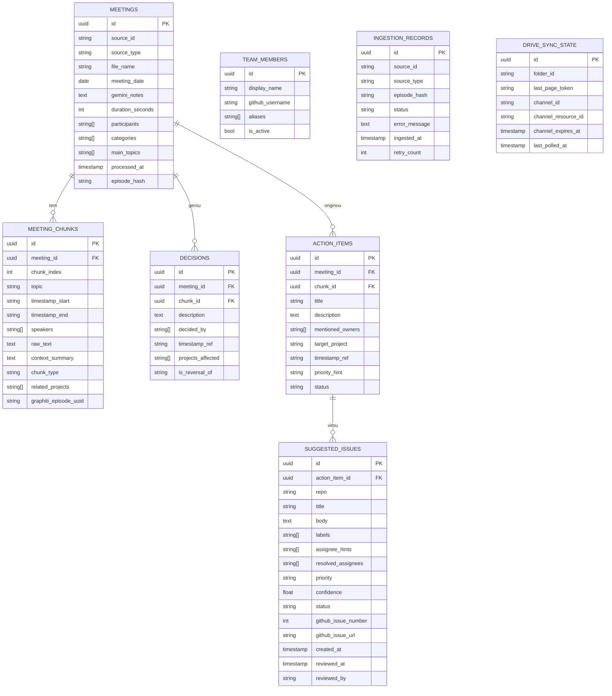

### 9.2 Estados de `SuggestedIssue`

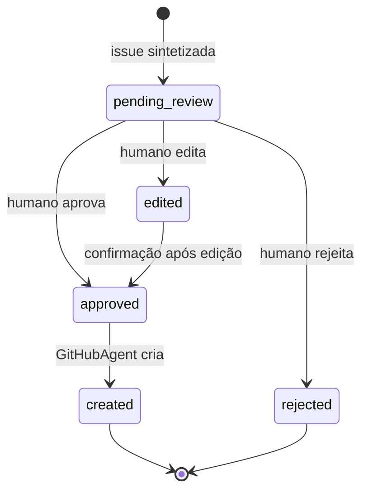

### 9.3 Estados de `IngestionRecord`

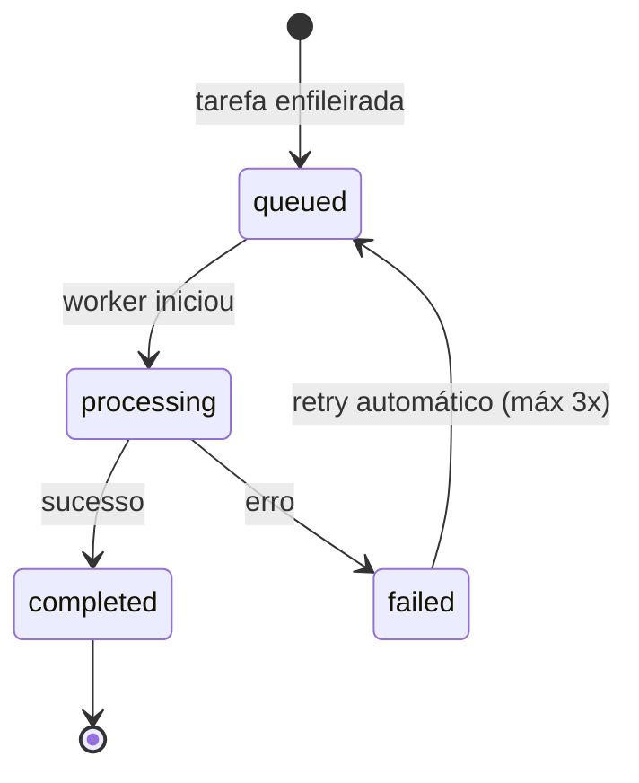

---

## 10. Knowledge Graph (Graphiti)

### O que é o Graphiti

O Graphiti é o coração da knowledge base. Ele mantém um **grafo temporal de contexto** onde cada fato tem uma janela de validade (`valid_at` / `invalid_at`). Quando uma decisão é revertida, o fato antigo é invalidado -- não deletado. Isso permite queries do tipo *"o que era verdade em fevereiro?"*

### Estrutura do Grafo

```
Entidades (nodes):
  - Person:   Felipe Adeildo, Alexandre Farias, Mateus Borges, Adelmo Inamura
  - Project:  ada, grace, dorothy, ranqia
  - Concept:  multi-tenant, worker, ARQ, Celery, auth, billing

Relacionamentos (edges com valid_at / invalid_at):
  - (Felipe) -[RESPONSÁVEL_POR]-> (Ada)          valid_at: 2026-01-01
  - (Ada) -[USA_TECNOLOGIA]-> (Celery)            valid_at: 2026-01-01, invalid_at: 2026-03-15
  - (Ada) -[USA_TECNOLOGIA]-> (ARQ)               valid_at: 2026-03-15
  - (Ada) -[TEM_FEATURE]-> (multi-tenant)         valid_at: 2026-02-10
  - (Felipe) -[VAI_FAZER]-> (migração Celery→ARQ) valid_at: 2026-03-15

Episódios (proveniência):
  - Cada edge aponta para o(s) chunk(s) que o originaram
  - Full lineage: fato → chunk → meeting → drive file
```

### Como os episódios são adicionados

Cada `ThematicChunk` se torna um episódio no Graphiti:

```python
await graphiti.add_episode(
    name=f"{meeting.file_name} · {chunk.topic}",
    episode_body=chunk.context_summary + "\n\n" + chunk.raw_text,
    source=EpisodeType.text,
    source_description=f"meeting_transcript · {meeting.meeting_date}",
    reference_time=meeting.occurred_at,  # quando a reunião aconteceu, não quando foi processada
    group_id=meeting.source_id,          # agrupa chunks da mesma reunião
)
```

O Graphiti automaticamente:
1. Extrai entidades e relacionamentos do texto
2. Compara com entidades existentes (deduplicação automática)
3. Invalida fatos contraditórios com o registro temporal correto
4. Constrói o hybrid index (semântico + BM25) para retrieval

### Queries Suportadas

```python
# Busca híbrida (semântica + keyword + graph traversal)
results = await graphiti.search(
    "decisões de arquitetura do Ada sobre workers"
)

# Busca com filtro temporal
results = await graphiti.search(
    "responsabilidades do Felipe",
    center_node_uuid=felipe_entity_uuid,  # grafo centrado em Felipe
)

# Nodes por tipo
nodes = await graphiti.get_nodes_by_query("Ada")

# Edges de um node
edges = await graphiti.get_edges_by_node_uuid(ada_node_uuid)
```

### Ontologia Customizada

O Graphiti suporta tipos customizados via Pydantic. Definir a ontologia do domínio explicitamente melhora muito a qualidade do grafo:

```python
from graphiti_core.nodes import EntityNode
from graphiti_core.edges import EntityEdge

class PersonNode(EntityNode):
    role: str | None = None          # "Founder Engineer", "CEO"
    github_username: str | None = None

class ProjectNode(EntityNode):
    repo_name: str                   # "ada", "grace"
    tech_stack: list[str] = []

class DecisionEdge(EntityEdge):
    decided_by: list[str] = []
    rationale: str | None = None
    meeting_date: date | None = None
```

---

## 11. Identificação e Matching de Entidades Nomeadas

Este é um dos pontos mais delicados do sistema. A transcrição menciona "Felipe", "o Mateus", "Adelmo", "o Ale" -- e precisamos mapear isso para entidades canônicas e, eventualmente, para GitHub usernames.

### 11.1 O Problema

- Nomes aparecem de formas diferentes: "Felipe", "Felipe Adeildo", "o Lipe"
- A mesma pessoa pode ser mencionada por apelido, primeiro nome, ou nome completo
- O speaker label da transcrição é sempre nome completo (vem do Google Meet)
- As menções **dentro do texto** podem ser informais

### 11.2 Estratégia de Resolução

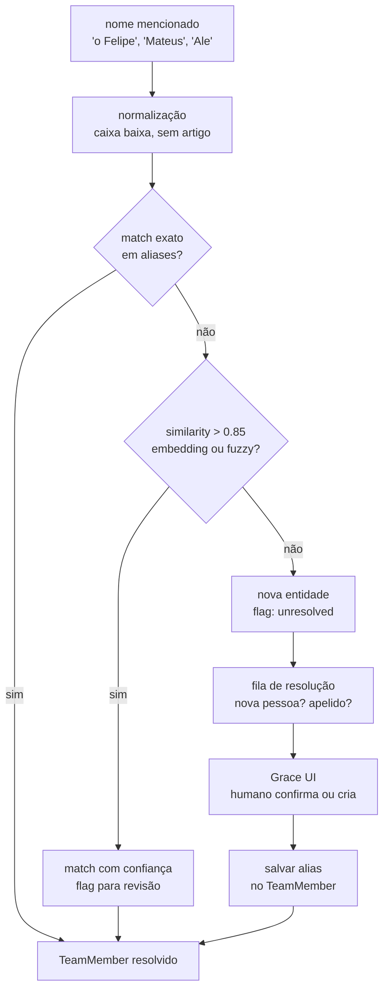

### 11.3 Tabela `team_members`

```python
class TeamMember(BaseModel):
    id:               UUID
    display_name:     str          # "Felipe Adeildo" -- nome canônico
    github_username:  str | None   # "felipeadeildo"
    aliases:          list[str]    # ["Felipe", "Lipe", "Adeildo", "o Felipe"]
    is_active:        bool         # membro atual da equipe
    role:             str | None   # "Founder Engineer"
```

O `github_username` é preenchido **manualmente** via interface, selecionando de uma lista dos membros do projeto no GitHub. Nunca inferido automaticamente.

### 11.4 Matching no Pipeline

No `EntityExtractorAgent`, os `mentioned_owners` são strings cruas como aparecem na transcrição. Um passo separado (pós-extração, pré-síntese) faz o resolution:

```python
class EntityResolver:
    def resolve(self, raw_name: str) -> TeamMember | UnresolvedEntity:
        # 1. lookup direto em aliases (case-insensitive)
        # 2. fuzzy match (rapidfuzz, threshold 85)
        # 3. embedding similarity (threshold 0.9)
        # 4. fallback: UnresolvedEntity para revisão humana
```

Entidades não resolvidas são salvas como `UnresolvedEntity` e aparecem na Grace UI para o humano confirmar o match ou criar um novo `TeamMember`.

### 11.5 Mapeamento GitHub Username

O mapeamento de `display_name → github_username` é feito exclusivamente via interface:

1. Brain API expõe `GET /github/collaborators?repo=ada` (usa PyGithub)
2. Grace UI mostra lista de colaboradores do GitHub para seleção
3. Humano seleciona o username correto para cada entidade nomeada
4. Salvo em `team_members.github_username`

---

## 12. Pipeline de Sugestão de Issues

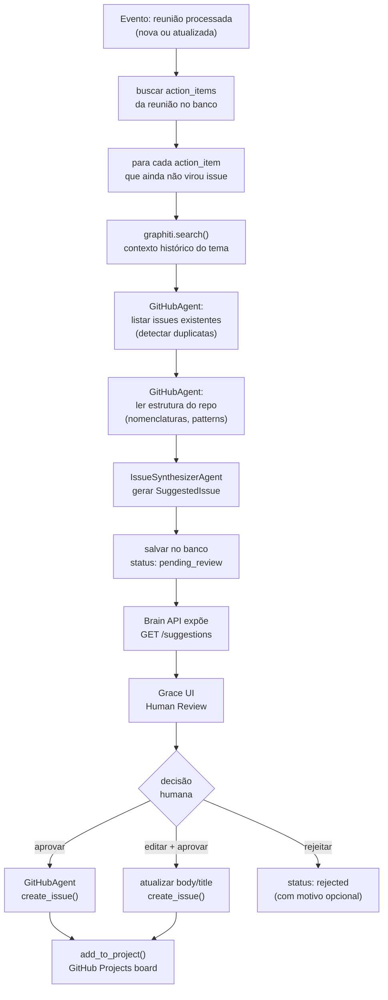

### Contexto injetado no IssueSynthesizerAgent

O agente recebe:
1. O `ActionItem` extraído da reunião
2. Chunks do Graphiti relevantes para o tema (histórico de decisões)
3. Issues existentes no repo alvo (raw JSON do GitHub)
4. Estrutura de diretórios do repo (para contextualização técnica)
5. `TeamMember`s ativos com seus `github_username`s (para sugestão de assignee)

### Body template da issue gerada

```markdown
## Contexto

{descrição do contexto extraída do Graphiti -- por que isso precisa ser feito}

## O que precisa ser feito

{descrição clara da task, extraída do action item}

## Evidências

> Reunião: {meeting_file_name} · {meeting_date}
> Timestamp: {timestamp_ref}
> 
> *"{trecho da transcrição}"*

## Notas adicionais

{qualquer contexto técnico relevante extraído dos chunks}

---
*Sugerido automaticamente pelo ranqia-brain · Revisado por: {reviewer}*
```

---

## 13. Integração com Google Drive & Google Docs

### 13.1 Autenticação

Para operação **server-side** (sem usuário na frente), usar **Service Account**:

1. Criar Service Account no Google Cloud Console
2. Baixar o JSON de credenciais
3. Compartilhar a pasta `Meeting Records` com o email da Service Account (`brain@...iam.gserviceaccount.com`)
4. Configurar via variável de ambiente `GOOGLE_SA_CREDENTIALS_JSON`

```python
from google.oauth2 import service_account
from googleapiclient.discovery import build

SCOPES = [
    "https://www.googleapis.com/auth/drive.readonly",
]

creds = service_account.Credentials.from_service_account_info(
    json.loads(os.environ["GOOGLE_SA_CREDENTIALS_JSON"]),
    scopes=SCOPES,
)
drive_service = build("drive", "v3", credentials=creds)
docs_service  = build("docs",  "v1", credentials=creds)
```

### 13.2 Listagem e Monitoramento

```python
# Listar arquivos em uma pasta (com paginação)
def list_folder(drive, folder_id: str, modified_after: datetime | None = None):
    query = f"'{folder_id}' in parents and trashed=false"
    if modified_after:
        ts = modified_after.isoformat() + "Z"
        query += f" and modifiedTime > '{ts}'"
    
    page_token = None
    while True:
        resp = drive.files().list(
            q=query,
            fields="nextPageToken, files(id, name, mimeType, modifiedTime)",
            pageToken=page_token,
        ).execute()
        yield from resp.get("files", [])
        page_token = resp.get("nextPageToken")
        if not page_token:
            break
```

### 13.3 Download de DOCX

Arquivos do tipo `application/vnd.google-apps.document` (Google Docs) precisam ser exportados:

```python
def download_as_docx(drive, file_id: str) -> bytes:
    request = drive.files().export_media(
        fileId=file_id,
        mimeType="application/vnd.openxmlformats-officedocument.wordprocessingml.document",
    )
    buf = io.BytesIO()
    downloader = MediaIoBaseDownload(buf, request)
    done = False
    while not done:
        _, done = downloader.next_chunk()
    return buf.getvalue()
```

> **Nota:** arquivos `.docx` já upados (não Google Docs nativos) são baixados com `files().get_media()` ao invés de `export_media()`. O adapter detecta pelo `mimeType`.

### 13.4 Leitura de Tabs via Docs API

Para acessar as tabs separadas (Notas vs Transcrição) de um Google Docs nativo:

```python
def get_doc_tabs(docs, file_id: str) -> dict[str, str]:
    """Retorna {tab_title: conteúdo_texto} para todas as tabs."""
    doc = docs.documents().get(
        documentId=file_id,
        includeTabsContent=True,
    ).execute()
    
    result = {}
    for tab in doc.get("tabs", []):
        props = tab.get("tabProperties", {})
        title = props.get("title", f"tab_{props.get('index', 0)}")
        result[title] = extract_tab_text(tab)
    return result

def extract_tab_text(tab: dict) -> str:
    """Extrai texto puro de uma tab, incluindo child tabs."""
    text = ""
    doc_tab = tab.get("documentTab", {})
    for elem in doc_tab.get("body", {}).get("content", []):
        paragraph = elem.get("paragraph")
        if paragraph:
            for pe in paragraph.get("elements", []):
                run = pe.get("textRun")
                if run:
                    text += run.get("content", "")
    for child in tab.get("childTabs", []):
        text += extract_tab_text(child)
    return text
```

> **Nota:** Na prática, os arquivos do Google Meet são exportados como `.docx` antes de chegar no Docling. A Docs API fica como alternativa de leitura direta quando o arquivo for um Google Doc nativo e não precisar de download.

---

## 14. Integração com GitHub

### 14.1 Autenticação

Via **Personal Access Token** (PAT) ou **GitHub App**:

```python
from github import Github, Auth

# PAT (mais simples, para começar)
gh = Github(auth=Auth.Token(os.environ["GITHUB_TOKEN"]))
org = gh.get_organization("ranqialabs")

# Repos disponíveis
repos = {
    "ada":     org.get_repo("ada"),
    "grace":   org.get_repo("grace"),
    "dorothy": org.get_repo("dorothy"),
}
```

### 14.2 Leitura de Issues

```python
def get_open_issues(repo_name: str) -> list[GitHubIssueSummary]:
    repo = repos[repo_name]
    return [
        GitHubIssueSummary(
            number=issue.number,
            title=issue.title,
            body=issue.body or "",
            labels=[l.name for l in issue.labels],
            assignees=[a.login for a in issue.assignees],
            state=issue.state,
            created_at=issue.created_at,
        )
        for issue in repo.get_issues(state="open")
    ]
```

### 14.3 Criação de Issues

Somente chamada **após aprovação humana** via Brain API:

```python
def create_issue(repo_name: str, issue: ApprovedIssue) -> CreatedIssue:
    repo = repos[repo_name]
    github_issue = repo.create_issue(
        title=issue.title,
        body=issue.body,
        labels=issue.labels,
        assignees=issue.assignees,  # github usernames já resolvidos
    )
    # adicionar ao GitHub Projects via GraphQL API (PyGithub usa REST)
    add_issue_to_project(github_issue.node_id, PROJECT_ID)
    return CreatedIssue(
        number=github_issue.number,
        url=github_issue.html_url,
        node_id=github_issue.node_id,
    )
```

### 14.4 GitHub Projects (GraphQL)

O GitHub Projects usa GraphQL para adicionar items:

```python
import httpx

GITHUB_GRAPHQL = "https://api.github.com/graphql"

async def add_issue_to_project(issue_node_id: str, project_id: str):
    query = """
    mutation($projectId: ID!, $contentId: ID!) {
      addProjectV2ItemById(input: {projectId: $projectId, contentId: $contentId}) {
        item { id }
      }
    }
    """
    async with httpx.AsyncClient() as client:
        resp = await client.post(
            GITHUB_GRAPHQL,
            headers={"Authorization": f"Bearer {GITHUB_TOKEN}"},
            json={"query": query, "variables": {
                "projectId": project_id,
                "contentId": issue_node_id,
            }},
        )
        resp.raise_for_status()
```

---

## 15. API Pública (Brain API)

A Brain API é construída com FastAPI e serve como interface entre o core do sistema e a Grace UI. Não tem autenticação inicialmente (rodar em rede interna).

### Endpoints

```
# Meetings
GET  /meetings                    lista reuniões processadas (paginado)
GET  /meetings/{id}               detalhes de uma reunião
GET  /meetings/{id}/chunks        chunks temáticos
GET  /meetings/{id}/action-items  action items extraídos
POST /meetings/{id}/reprocess     reprocessar uma reunião

# Knowledge Base
GET  /knowledge/search?q=...      busca semântica no Graphiti
GET  /knowledge/entities          lista entidades do grafo
GET  /knowledge/decisions         lista decisões (com filtros)

# Issues
GET  /suggestions                 lista issues pendentes de revisão
GET  /suggestions/{id}            detalhes de uma sugestão
PATCH /suggestions/{id}           editar title/body/labels/assignees
POST /suggestions/{id}/approve    aprovar → criar no GitHub
POST /suggestions/{id}/reject     rejeitar (com motivo opcional)

# Team
GET  /team                        lista team members
POST /team/{id}/link-github       vincular github_username
GET  /team/unresolved             entidades não resolvidas

# GitHub
GET  /github/repos                lista repos disponíveis
GET  /github/issues/{repo}        lista issues do repo
GET  /github/collaborators/{repo} lista colaboradores (para vincular)

# System
GET  /health                      status do sistema
GET  /ingestion/status            status do pipeline de ingestão
POST /ingestion/trigger-bulk      disparar bulk run inicial
```

### Exemplo de resposta `GET /suggestions`

```json
{
  "items": [
    {
      "id": "uuid",
      "repo": "ada",
      "title": "Implementar reset de senha via Resend",
      "body": "## Contexto\n\nDecisão tomada na reunião de 15/03...",
      "labels": ["feature", "auth"],
      "assignee_hints": ["Felipe Adeildo"],
      "resolved_assignees": ["felipeadeildo"],
      "priority": "low",
      "confidence": 0.89,
      "status": "pending_review",
      "evidence": [
        {
          "meeting_file": "Adeildo <> Ale - Transcrição",
          "timestamp": "00:01:16",
          "snippet": "Tipo esse forgot password, reset res, porque eh a gente vai precisar de algum serviço de e-mail...",
          "drive_file_id": "1abc..."
        }
      ],
      "conflicts_with_existing": null,
      "created_at": "2026-03-19T12:00:00Z"
    }
  ],
  "total": 14,
  "page": 1
}
```

---

## 16. Interface de Revisão Humana

A interface de revisão é construída em **Grace** (Next.js). É uma página simples focada em revisão eficiente, não em estética.

### Fluxo de Revisão

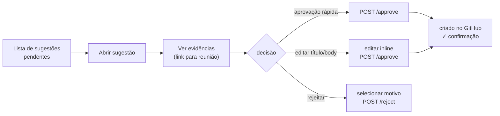

### Funcionalidades da UI de Revisão

1. **Fila de sugestões**: lista filtrada por repo, prioridade, status
2. **Card de sugestão**: título editável, body em markdown editável inline, labels, assignee (selecionado via dropdown dos colaboradores do GitHub)
3. **Painel de evidências**: trechos da transcrição com timestamp, link para o arquivo no Drive
4. **Detecção de conflito**: se `conflicts_with_existing` não for null, mostrar as issues possivelmente duplicadas com link
5. **Aprovação em massa**: aprovar múltiplas sugestões de baixo risco de uma vez
6. **Mapeamento de entidades**: seção separada para vincular nomes à usernames do GitHub

---

## 17. LLM Providers & Embeddings

### 17.1 Abstração de Providers

O sistema usa as abstrações nativas do `pydantic-ai` e do `graphiti-core`, que suportam múltiplos providers. A configuração é feita via variáveis de ambiente.

### 17.2 LLM para Agentes (pydantic-ai)

| Provider | Modelo | Uso | Trade-off |
|---|---|---|---|
| OpenAI | `gpt-4o` | padrão -- agentes principais | ótima structured output |
| Anthropic | `claude-sonnet-4-6` | alternativa para síntese longa | melhor raciocínio longo |
| Ollama (local) | `qwen2.5:14b` ou similar | dev sem custo / privacidade | structured output menos confiável |

Configuração por variável:
```env
LLM_PROVIDER=openai         # openai | anthropic | ollama
LLM_MODEL=gpt-4o
LLM_BASE_URL=               # preenchido apenas para Ollama: http://localhost:11434/v1
LLM_API_KEY=sk-...
```

### 17.3 LLM para Graphiti (graph construction)

O Graphiti precisa de um modelo com **structured output confiável** para construir o grafo. Modelos menores locais podem falhar na extração de entidades.

| Provider | Modelo | Observação |
|---|---|---|
| OpenAI | `gpt-4o-mini` | padrão -- bom custo-benefício para ingestion |
| Anthropic | `claude-haiku-4-5` | alternativa econômica |
| Ollama | `qwen2.5:14b` | funciona com modelos 14b+, mais lento |

```env
GRAPHITI_LLM_PROVIDER=openai
GRAPHITI_LLM_MODEL=gpt-4o-mini
GRAPHITI_LLM_SMALL_MODEL=gpt-4o-mini
```

### 17.4 Embeddings

| Provider | Modelo | Dimensão | Observação |
|---|---|---|---|
| OpenAI | `text-embedding-3-small` | 1536 | padrão -- barato, rápido |
| Ollama | `nomic-embed-text` | 768 | local, privado, gratuito |
| Sentence Transformers | `all-MiniLM-L6-v2` | 384 | totalmente local via Python |

```env
EMBEDDING_PROVIDER=openai                   # openai | ollama | sentence_transformers
EMBEDDING_MODEL=text-embedding-3-small
EMBEDDING_DIM=1536
```

> **Nota:** trocar o provider de embedding depois de popular o grafo exige reindexação total. Escolher e manter consistente desde o início.

### 17.5 Configuração Completa

```python
# settings.py (pydantic-settings)
from pydantic_settings import BaseSettings

class Settings(BaseSettings):
    # LLM para agentes
    llm_provider:   str = "openai"
    llm_model:      str = "gpt-4o"
    llm_api_key:    str
    llm_base_url:   str | None = None

    # LLM para Graphiti
    graphiti_llm_provider:    str = "openai"
    graphiti_llm_model:       str = "gpt-4o-mini"
    graphiti_llm_api_key:     str  # pode ser o mesmo que llm_api_key

    # Embeddings
    embedding_provider: str = "openai"
    embedding_model:    str = "text-embedding-3-small"
    embedding_dim:      int = 1536
    embedding_api_key:  str

    # Graph DB
    graph_db_type:     str = "falkordb"  # falkordb | neo4j
    falkordb_host:     str = "localhost"
    falkordb_port:     int = 6379
    neo4j_uri:         str = "bolt://localhost:7687"
    neo4j_user:        str = "neo4j"
    neo4j_password:    str = "password"

    # Google
    google_sa_credentials_json: str     # JSON completo da Service Account
    google_drive_folder_id:     str     # ID da pasta "Meeting Records"
    google_drive_poll_interval: int = 300  # segundos

    # GitHub
    github_token:      str
    github_org:        str = "ranqialabs"
    github_project_id: str               # ID do GitHub Project

    # Redis / Celery
    redis_url: str = "redis://localhost:6379/0"

    class Config:
        env_file = ".env"
```

---

## 18. Observabilidade

> **Status:** não prioritário no MVP. Planejado para uma fase posterior.

Quando implementado, o sistema deve emitir:

- **Traces**: cada ingestão completa (source → parse → agents → graphiti) como um trace distribuído
- **Métricas**:
  - `ingestion.duration_seconds` por source_type
  - `agent.llm_calls_total` por agente
  - `graphiti.episodes_total` e `graphiti.search_latency_seconds`
  - `suggestions.created_total`, `suggestions.approved_ratio`
- **Logs estruturados**: JSON com campos `source_id`, `agent_name`, `status`, `duration_ms`

O `pydantic-ai` tem integração nativa com OpenTelemetry. O `graphiti-core` emite spans OTEL nativamente. Ambos podem ser direcionados para qualquer backend OTEL (Jaeger, Grafana Tempo, etc.) sem modificação.

---

## 19. Extensibilidade: Novas Sources

Para adicionar uma nova fonte (ex: WhatsApp), apenas criar um novo adapter:

### Exemplo: WhatsAppAdapter

```python
class WhatsAppAdapter(SourceAdapter):
    """
    Usa o whatsapp-mcp (felipeadeildo/whatsapp-mcp) como fonte.
    O MCP server expõe mensagens do grupo de devs.
    """
    async def watch(self) -> AsyncIterator[RawEpisode]:
        async for message in self.mcp_client.stream_messages(
            group_id=self.dev_group_id,
            after=self.last_processed_at,
        ):
            # agrupa mensagens em "sessões" de 30min sem gaps
            session = self.session_buffer.add(message)
            if session.is_closed():
                yield self._to_raw_episode(session)

    def _to_raw_episode(self, session: MessageSession) -> RawEpisode:
        return RawEpisode(
            source_id    = session.id,
            source_type  = SourceType.WHATSAPP,
            source_name  = f"WhatsApp Dev Group · {session.date}",
            content      = session.format_as_transcript(),
            participants = session.participants,
            occurred_at  = session.start_time,
            metadata     = {"message_count": len(session.messages)},
        )
```

**Nenhuma outra parte do código precisa mudar.** O pipeline de agentes recebe `RawEpisode` independentemente da fonte.

### Registro de Adapters

```python
# adapters/__init__.py
ADAPTERS: dict[SourceType, SourceAdapter] = {
    SourceType.GOOGLE_DRIVE: GoogleDriveAdapter(),
    # SourceType.WHATSAPP:   WhatsAppAdapter(),   # descomentado quando pronto
    # SourceType.SLACK:      SlackAdapter(),
}
```

---

## 20. Docker Compose & Infraestrutura Local

O `docker-compose.yml` deve orquestrar todos os serviços necessários para desenvolvimento local:

```yaml
# docker-compose.yml (esboço -- nome do projeto a definir)
services:

  # Graph Database
  falkordb:
    image: falkordb/falkordb:latest
    ports:
      - "6379:6379"   # Redis-compatible port
      - "3000:3000"   # Browser UI
    volumes:
      - falkordb_data:/data

  # Message Broker & Celery Backend
  redis:
    image: redis:7-alpine
    ports:
      - "6380:6379"   # porta diferente para não conflitar com FalkorDB
    volumes:
      - redis_data:/data

  # Brain API
  api:
    build: .
    command: uvicorn ranqia_brain.api.main:app --host 0.0.0.0 --port 8000 --reload
    ports:
      - "8000:8000"
    env_file: .env
    depends_on:
      - falkordb
      - redis
    volumes:
      - .:/app

  # Celery Worker (ingestão)
  worker:
    build: .
    command: celery -A ranqia_brain.worker.app worker --loglevel=info --concurrency=4
    env_file: .env
    depends_on:
      - redis
      - falkordb
    volumes:
      - .:/app

  # Celery Beat (scheduler -- polling do Drive)
  beat:
    build: .
    command: celery -A ranqia_brain.worker.app beat --loglevel=info
    env_file: .env
    depends_on:
      - redis
    volumes:
      - .:/app

volumes:
  falkordb_data:
  redis_data:
```

> **Nota:** O nome do projeto (`ranqia-brain` ou outro) será definido antes da criação do repositório.

---

## 21. Estrutura do Repositório

```
ranqia-brain/              (nome a confirmar)
├── pyproject.toml
├── .env.example
├── docker-compose.yml
├── Dockerfile
│
├── ranqia_brain/
│   ├── __init__.py
│   │
│   ├── config.py              # Settings (pydantic-settings)
│   ├── models.py              # Modelos Pydantic compartilhados
│   │
│   ├── sources/               # Source Adapters
│   │   ├── __init__.py        # ADAPTERS dict + SourceAdapter protocol
│   │   ├── base.py            # RawEpisode, SourceType, SourceAdapter
│   │   └── google_drive.py    # GoogleDriveAdapter
│   │
│   ├── parsing/               # Document Parsers
│   │   ├── __init__.py        # PARSERS list + DocumentParser protocol
│   │   ├── base.py            # ParsedMeeting, TranscriptSegment
│   │   └── gemini_docx.py     # GeminiDocxParser (Docling)
│   │
│   ├── agents/                # Agentes pydantic-ai
│   │   ├── __init__.py
│   │   ├── classifier.py      # ClassifierAgent
│   │   ├── chunker.py         # ChunkerAgent
│   │   ├── contextualizer.py  # ContextualizerAgent
│   │   ├── entity_extractor.py # EntityExtractorAgent
│   │   ├── issue_synthesizer.py # IssueSynthesizerAgent
│   │   └── github_agent.py    # GitHubAgent
│   │
│   ├── knowledge/             # Graphiti wrapper
│   │   ├── __init__.py
│   │   ├── graph.py           # inicialização do Graphiti
│   │   ├── ontology.py        # tipos customizados (PersonNode, ProjectNode, etc.)
│   │   └── queries.py         # helpers de busca
│   │
│   ├── entities/              # Named Entity Resolution
│   │   ├── __init__.py
│   │   └── resolver.py        # EntityResolver
│   │
│   ├── integrations/
│   │   ├── github.py          # PyGithub wrapper
│   │   └── google.py          # Drive + Docs API wrapper
│   │
│   ├── worker/                # Celery
│   │   ├── app.py             # instância do Celery
│   │   └── tasks.py           # tarefas de ingestão
│   │
│   ├── db/                    # Banco relacional
│   │   ├── models.py          # ORM models (SQLModel ou SQLAlchemy)
│   │   ├── migrations/        # Alembic
│   │   └── session.py
│   │
│   └── api/                   # Brain API (FastAPI)
│       ├── main.py
│       └── routers/
│           ├── meetings.py
│           ├── knowledge.py
│           ├── suggestions.py
│           ├── team.py
│           ├── github.py
│           └── system.py
│
└── tests/
    ├── unit/
    └── integration/
```

---

## 22. Decisões em Aberto

| # | Decisão | Opções | Status |
|---|---|---|---|
| 1 | Nome definitivo do projeto | `ranqia-brain`, `brain`, outro | pendente |
| 2 | Graph DB em prod | FalkorDB gerenciado vs Neo4j AuraDB | pendente |
| 3 | Banco relacional | SQLite (dev) + PostgreSQL (prod) vs apenas PostgreSQL | pendente |
| 4 | Bulk run inicial | CLI command vs endpoint na API vs task manual | pendente |
| 5 | Auth da Brain API | nenhuma (rede interna) vs API key simples vs OAuth | pendente |
| 6 | Persistência do FalkorDB | volume Docker vs managed service | pendente |
| 7 | GitHub auth | PAT pessoal vs GitHub App (org-level) | pendente |
| 8 | WhatsApp adapter | via `whatsapp-mcp` (já existente) vs implementação direta | planejado |
| 9 | ORM para banco relacional | SQLModel vs SQLAlchemy + Alembic puro | pendente |

---

*Última atualização: Março 2026*
